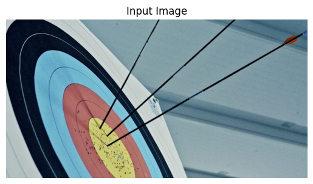
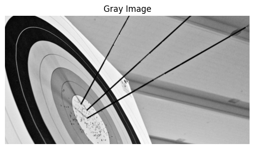
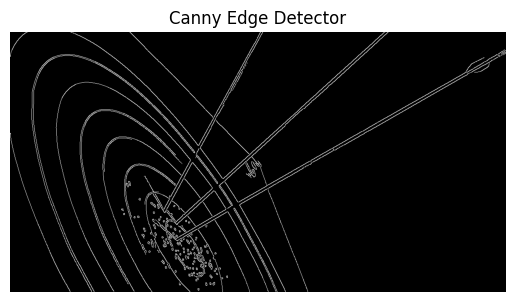
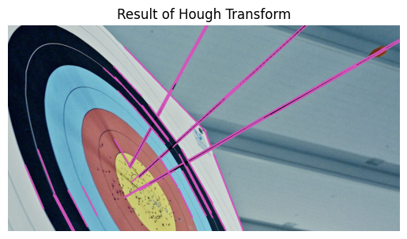

# Edge-Linking-using-Hough-Transform
## Aim:
To write a Python program to detect the lines using Hough Transform.

## Software Required:
Anaconda - Python 3.7

## Algorithm:
### Step1:

Import all the necessary modules for the program.
### Step2:

Load a image using imread() from cv2 module.
### Step3:

Convert the image to grayscale.
### Step4:

Using Canny operator from cv2,detect the edges of the image.
### Step5:

Using the HoughLinesP(),detect line co-ordinates for every points in the images.Using For loop,draw the lines on the found co-ordinates.Display the image.

## Program:

```

Developed By : Krishna Prasad S
Register No. : 212223230108

```
```py

# Import necessary Librares

import cv2
import numpy as np
import matplotlib.pyplot as plt

# Read the image

image = cv2.imread('archery1.jpg')
plt.imshow(cv2.cvtColor(image, cv2.COLOR_BGR2RGB))  
plt.title("Input Image")
plt.axis('off')

# Grayscale image

gray_image = cv2.cvtColor(image, cv2.COLOR_BGR2GRAY)
gray_image = cv2.GaussianBlur(gray_image,(3,3),0)
plt.imshow(gray_image, cmap = 'gray')  
plt.title("Gray Image")
plt.axis('off')

# Canny Edge detector

edges = cv2.Canny(gray_image, 50, 150)
plt.imshow(edges, cmap='gray')
plt.title("Canny Edge Detector")
plt.axis('off')

# Hough transform

lines = cv2.HoughLinesP(edges, 1, np.pi / 180, 100, minLineLength=50, maxLineGap=10)
for line in lines:
    x1, y1, x2, y2 = line[0]  
    cv2.line(image, (x1, y1), (x2, y2), (186,85,211), 3)  

# Display the result of Hough Transform (Image with lines)

plt.imshow(cv2.cvtColor(image, cv2.COLOR_BGR2RGB))  # Image with lines drawn
plt.title("Result of Hough Transform")
plt.axis('off')

```


## Output:

### Input image and grayscale image





### Canny Edge detector output



### The result of Hough transform




## Result:

Thus the Lines in the image have been detected using Hough Transform Successfully.
